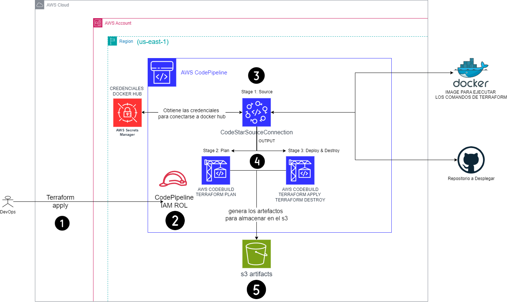
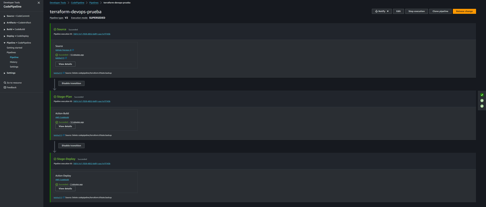
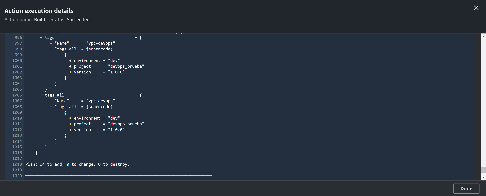

# Terraform DevOps Prueba

## Objectivo

Diseñar la infraestructura utilizando Terraform, incluyendo:
▪ VPC con subredes públicas y privadas
▪ Grupos de seguridad para instancias de servidores web y bases de datos
▪ Instancia EC2 para el servidor web
▪ Instancia RDS para la base de datos.
▪ Depósito S3 para almacenar código de aplicación

## Indice

- ✅ [CODEPIPELINE](#codepipeline)
- ✅ [Ec2](#ec2)
- ✅ [S3](#s3)
- ✅ [RDS](#rds)
- ✅ [PROPUESTA](#propuesta)

#### CODEPIPELINE
Aqui se evidencia que se puedo desplegar en terraform desde el servicio "codepipeline", 
al igua que la arquitectura que se uso y en cual me base para hacer la mia propia.

Referencia hecha por AWS oficial [enlance](https://docs.aws.amazon.com/es_es/prescriptive-guidance/latest/patterns/create-a-ci-cd-pipeline-to-validate-terraform-configurations-by-using-aws-codepipeline.html)

Evidencias

#### Ec2
Se crea un instancia con dos subnet publica y privada, inicialmente se tenia planeado usar
los servicios de "ROUTE 53", "CERTIFICATE MANAGER" y "CLOUDWATCH", pero por cuestión de tiempo. 
No se puedo completar del todo; sin embargo, se tiene los modulos creados.
### instancia creada

### pagina web apache

### llave de acceso al ec2 (necesario crear en la consola para poder acceder al ec2)

### vpc

### subnet

### ACL

### grupo de seguridad

### tabla de enrutamiento

etiquedas homologadas

#### S3
Se sube todos los archivos de este proyecto en un bucket.

#### RDS
### Se crea un base de datos en postgresql

#### PROPUESTA
adicionalmente, tengo una propuesta para organizar cada entorno por ambientes "DEV", "QA" y "PROD".
